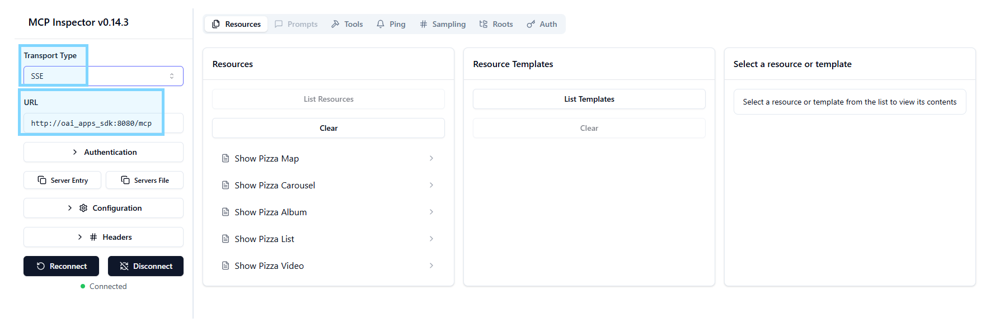

# Source
- https://github.com/openai/openai-apps-sdk-examples

# Setup 

- **Prerequisites**
    - Node.js 18+
    - pnpm (recommended) or npm/yarn
    - Python 3.10+

- **Install dependencies**
    - `pnpm install`

- **Build standalone HTML files**
    - `pnpm run build`

- **Run dev server**
    - `pnpm run dev`
    - Access to http://localhost:4444/index.html

- **Serve static files**
    - `pnpm run build` (build to `/assets`)
    - `pnpm run serve` (serve from `/assets`)
    - Access to http://localhost:4444/index.html

# MCP Servers (Node)
- **Start MCP server**
```bash
cd pizzaz_server_node
pnpm install
pnpm run start
```
- **Access to** http://localhost:8080/mcp

# MCP Inspector
- **Setup MCP Inspector** from https://github.com/weyseing/mcp-inspector-headers
- **MUST have same docker network**



# Test via ChatGPT
- Enable [developer mode](https://platform.openai.com/docs/guides/developer-mode), and add your apps in `Settings > Connectors`.


# [In-Review]


## Testing in ChatGPT

To add your local server without deploying it, you can use a tool like [ngrok](https://ngrok.com/) to expose your local server to the internet.

For example, once your mcp servers are running, you can run:

```bash
ngrok http 8000
```

You will get a public URL that you can use to add your local server to ChatGPT in Settings > Connectors.

For example: `https://<custom_endpoint>.ngrok-free.app/mcp`

## Next steps

- Customize the widget data: edit the handlers in `pizzaz_server_node/src`, `pizzaz_server_python/main.py`, or the solar system server to fetch data from your systems.
- Create your own components and add them to the gallery: drop new entries into `src/` and they will be picked up automatically by the build script.
