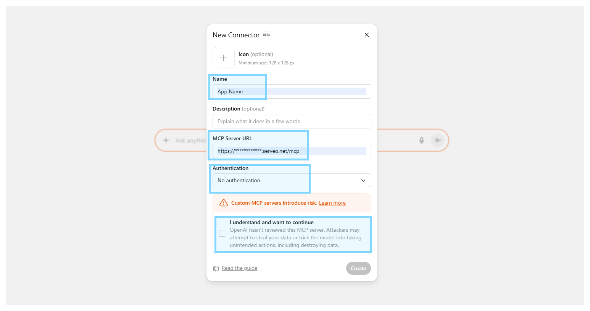
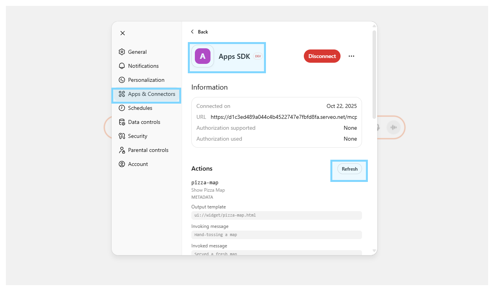

# Source
- https://github.com/openai/openai-apps-sdk-examples

# App Widget 

- **Prerequisites**
    - Node.js 18+
    - pnpm (recommended) or npm/yarn
    - Python 3.10+

- **Install dependencies**
    - `pnpm install`

- **Build standalone HTML files**
    - `pnpm run build`

- **Run dev server**
    - `pnpm run dev`
    - Access to http://localhost:4444/index.html

- **Serve static files**
    - `pnpm run build` (build to `/assets`)
    - `pnpm run serve` (serve from `/assets`)
    - Access to http://localhost:4444/index.html

# MCP Servers (Node)
- **Start MCP server**
```bash
cd pizzaz_server_node
pnpm install
pnpm run start
```
- **Access to** http://localhost:8080/mcp

# MCP Inspector
- **Setup MCP Inspector** from https://github.com/weyseing/mcp-inspector-headers
- **MUST have same docker network**


# ChatGPT Connector
- **Create public endpoint via Serveo**
```bash
ssh -R 80:localhost:8080 serveo.net
```

- **Enable [developer mode](https://platform.openai.com/docs/guides/developer-mode) and add apps in `Settings > Connectors`**.



- **Refresh apps whenever Widget UI (MCP resource) updated**

